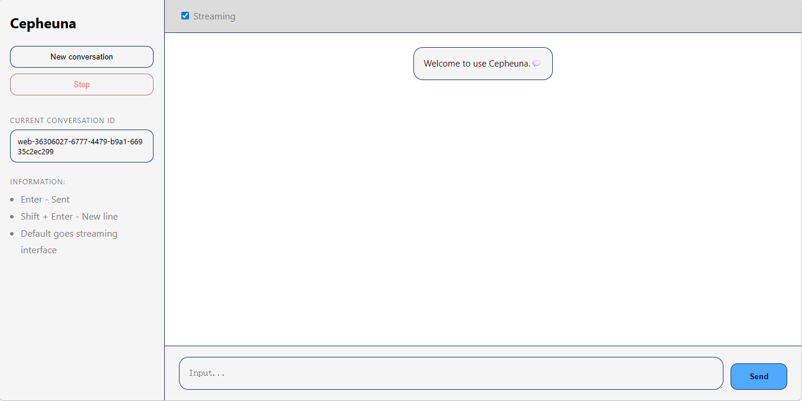
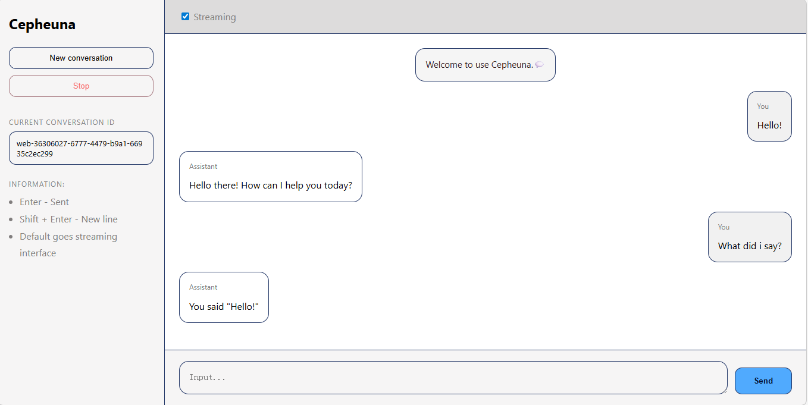

# *Cepheuna* -- Personal web assistant

## Project introduction
### *Cepheuna* is an open source web assistant,you can use browser to talk with AI simply.

---

## What can *Cepheuna* do?
* **Automatically** call tools
* Talk to AI in the **cloud**.Even if your computer is not with you, you can still talk to Cepheuna and operate your computer through the web.

### Webpage screenshot 👇



---

## How to use? For developers
### Prepare -- Requires
* `JDK` >= 21

### First -- Configure your openai-api-url and api-key

#### In `application.yml`:
```yaml
spring:
  ai:
    openai:
      api-key: sk-xxxx  # Enter your api-key,if it is in environment or running in docker,use ${OPENAI_API_KEY} instead
      base-url: https://api.openai.com   # Api url,you can replace it with your own transit station
```

### Second -- Compile the source and run the project
```shell
mvn clean package    # First: package
java -jar target/cepheuna.jar   # Run the jar
```

#### or

```shell
mvn spring-boot:run
```

### Third -- Talk with **Cepheuna**
#### Open your browser ( Any one is ok ) and access http://localhost:11622/
#### If you have seen the page,that means **Cepheuna** is running healthy.
#### If not,check the program is running, the url you enter is correct.

---

## How to use? For users
### Prepare -- Requires
* `JRE` >= 21
* `Cepheuna release jar` ( Enter [Cepheuna-Releases](https://github.com/Hakizumi/Cepheuna/releases) to download )

### First -- Configure your openai-api-url and api-key
At the same-folder of the `Cepheuna jar`,create a folder names `config`.
<br>
In the folder `config`,create a yaml file: `application.yml`.
<br>
In the `application.yml`,configure
```yaml
spring:
  ai:
    openai:
      api-key: sk-xxxx  # Enter your api-key,if it is in environment or running in docker,use ${OPENAI_API_KEY} instead
      base-url: https://api.openai.com   # Api url,you can replace it with your own transit station
```

### Second -- Run the Cepheuna program
At the same-folder of the `Cepheuna jar`,run shell:
```shell
java -jar cepheuna-x.x.x.jar
```

### Third -- Talk with **Cepheuna**
#### Open your browser ( Any one is ok ) and access http://localhost:11622/ ( or http://localhost:11622/chat )
#### If you have seen the page,that means **Cepheuna** is running healthy.
#### If not,check the program is running, the url you enter is correct.

---

## About **Cepheuna**
* Github: https://github.com/Hakizumi/Cepheuna
* Github-Releases: https://github.com/Hakizumi/Cepheuna/releases
* Developer: `Hakizumi`
* Contributors: None :(

---

#### LICENSE: [LICENSE](LICENSE)
#### CONTRIBUTING: [CONTRIBUTING](CONTRIBUTING.md)
#### SECURITY: [SECURITY](SECURITY.md)